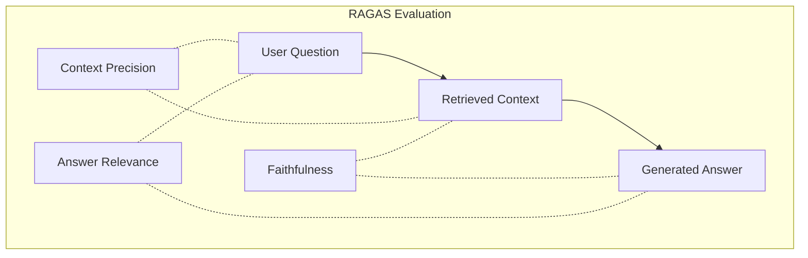

# Production AI Quality Engineering Patterns Playbook

This document outlines the core architecture, evaluation methodology, and observability patterns implemented in the HR Policy Assistant RAG application. 

---

## 1. RAG Evaluation Methodology (RAGAS)

Evaluating RAG systems requires shifting from traditional software testing (which relies on static assertions) to heuristic, LLM-based evaluation metrics. We implement three core metrics from the **RAGAS** framework to score our system quality:



### Context Precision (Retrieval Quality)
- **Goal**: Evaluates whether the retrieved policy chunks are relevant to the user's question, and if the most relevant information is ranked at the top.
- **Why it matters**: If context precision is low, the model receives noisy or irrelevant context, leading to poor generations or context-window stuffing.
- **Formula**: Assesses the ratio of relevant chunks inside the top-k retrieved list.

### Faithfulness (Groundedness / Hallucination Prevention)
- **Goal**: Evaluates if the generated answer is strictly grounded in the retrieved company policies without introducing outside assumptions or hallucinations.
- **Why it matters**: In HR environments (e.g., leave allowances, notice periods), model hallucinations represent severe compliance risks. Low faithfulness indicates the model is inventing company policy.
- **Formula**: Compares the generated answer claims against the retrieved source chunks.

### Answer Relevance (Instruction Following)
- **Goal**: Measures how directly the generated answer addresses the actual user query.
- **Why it matters**: A highly faithful answer that does not answer the user's specific question is useless. High relevance confirms that the model directly answers the prompt.
- **Formula**: Generates hypothetical questions from the generated answer and computes semantic similarity to the original question.

---

## 2. Dual Observability Architecture (LangSmith + Langfuse)

Observability is split into two distinct, complementary channels to optimize for both **development workflow speed** and **production business metrics**.

| Feature | LangSmith (Developer & Chain Engine Focus) | Langfuse (MLOps & Financial Analytics Focus) |
|---|---|---|
| **Primary Use Case** | Trace debugging, prompt playground runs, and interactive step inspection. | Production cost tracking, usage analytics, latency trends, and user feedback logs. |
| **Data Model** | Nested run trees matching LangChain/LangGraph trace protocols. | Flat spans, traces, and LLM generations mapped via OpenTelemetry conventions. |
| **Integration** | Automatically traces decorated functions via context propagation. | Explicitly logs token sizes and latency values inside Generation structures. |

### Technical Integration Details

Our service [rag.py](file:///Users/ztlab85/Desktop/KRI_KPI_Projects/backend/api/services/rag.py) uses decorators from both SDKs to log executions:
- **LangSmith Tracing**: Uses `@traceable(name="HR Policy RAG Q&A", run_type="chain")`. It captures execution contexts, input parameters, and dictionary outputs automatically.
- **Langfuse Tracing**: Uses `@observe(name="HR Policy RAG Q&A")`. Sub-functions are tagged as specific observation types:
  - `search_chunks` is an `@observe(as_type="span", name="Retrieve Chunks")` span.
  - `generate_text` is an `@observe(as_type="generation", name="Generate Text")` generation block logging token usages (`prompt_eval_count` and `eval_count`).

---

## 3. MLOps Best Practices & Regression Gates

As RAG prompts or chunking parameters change, it is vital to test for regression. We implement a **Regression Comparison Tool** within the dashboard:

```
[Baseline Run (A)]  --- Compare side-by-side --->  [New Run (B)]
- Context Precision: 85%                           - Context Precision: 90%
- Faithfulness: 90%                                - Faithfulness: 70%  ⚠️ REGRESSION!
```

### Steps to Evaluate RAG Updates
1. Run a baseline evaluation run: `python manage.py run_eval --name "Baseline v1" --score-with-ragas`.
2. Make modifications to your prompt templates in [rag.py](file:///Users/ztlab85/Desktop/KRI_KPI_Projects/backend/api/services/rag.py) or chunking sizes.
3. Run a comparison evaluation: `python manage.py run_eval --name "Prompt Update Test" --score-with-ragas`.
4. Open the **Regression** page on the Nuxt Dashboard, select both runs, and review the deltas. Any question that drops by more than 10% in quality will trigger a pulsing red alert badge.

---

## 4. Setting up the Weekly Automated Scheduler

We provide a bash script to trigger evaluation and RAGAS scoring automatically every week.

### The Shell Script
The [run_weekly_eval.sh](file:///Users/ztlab85/Desktop/KRI_KPI_Projects/backend/run_weekly_eval.sh) file handles environment loading and command execution:
1. Moves to the directory where the script resides.
2. Activates the Python virtual environment (`.venv/bin/activate`).
3. Runs the django command:
   ```bash
   .venv/bin/python manage.py run_eval --name "Weekly Automated Eval - $(date +'%Y-%m-%d')" --score-with-ragas
   ```
4. Stores stdout and stderr outputs to `backend/logs/evaluations/run_<YYYY-MM-DD>.log`.

### Scheduling with Cron
To run this script automatically every Sunday at midnight:

1. Open your user cron configuration editor:
   ```bash
   crontab -e
   ```
2. Append the following entry (adjusting the path to your workspace directory):
   ```bash
   0 0 * * 0 /Users/ztlab85/Desktop/KRI_KPI_Projects/backend/run_weekly_eval.sh
   ```
3. Save and close. The system scheduler will now run the scoring pipeline weekly. Logs will appear in `backend/logs/evaluations/`.
